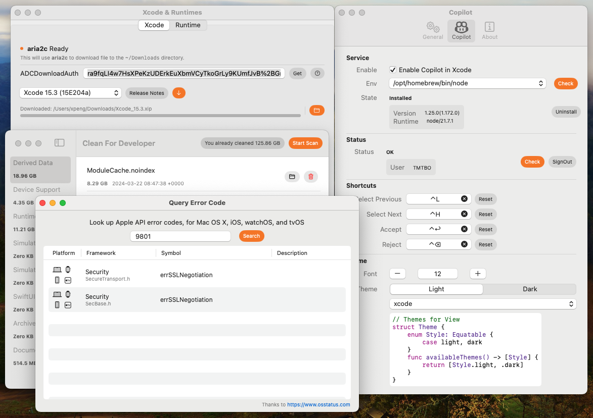

# XcodePilot

XcodePilot is a toolset App for Xcode. eg: Copilot, Xcode&amp;runtime Manager, Cleaner ...

## Features

- [x] Github Copilot with Xcode Source Editor Extension
- [x] Xcode & Runtime download and install
- [x] Apple Develop Cache Cleaner
- [x] Apple error code search

## Coming soon

- [] `Todo`/`Fixme` tag manage
- [] Sandbox browser
- [] Something your suggestions. [**I have a good idea**](https://github.com/TMTBO/XcodePilotApp/issues/new)

## Requirements

- Xcode 11.0+
- MacOS 13.0+

## Installation

### Homebrew

`brew install xcodepilot`

### Manually

- Download the latest release from [**here**](https://xcodepilot.thriller.fun/packages/appcast/appcast.xml)
- Unzip the downloaded file
- Drag the XcodePilot.app to the Applications folder

## FAQ

## Contact

Email: thrillerone@hotmail.com
